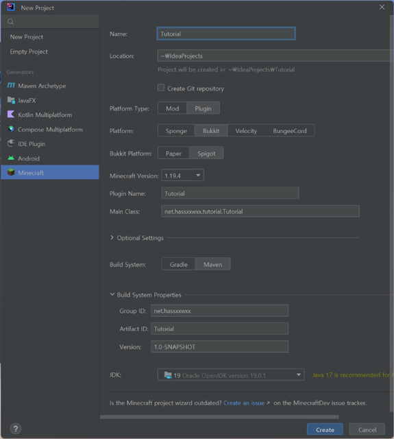
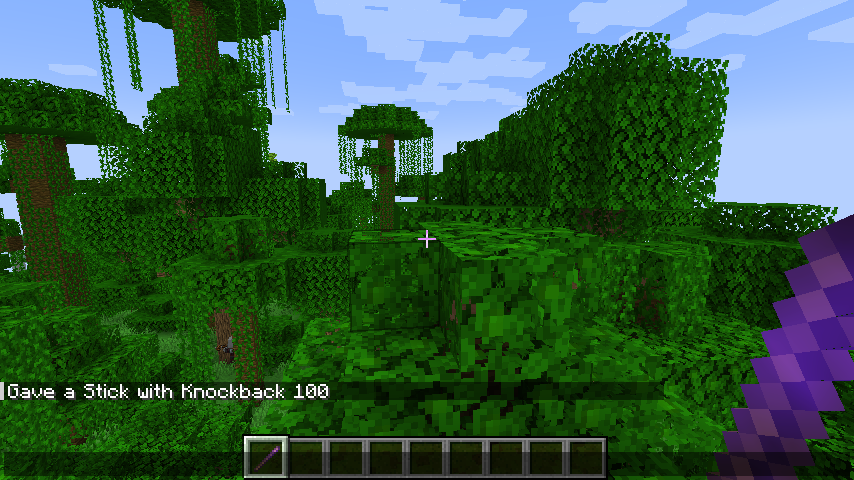
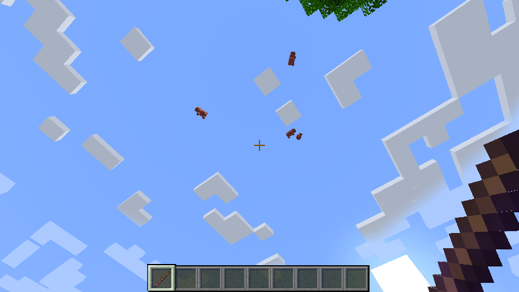
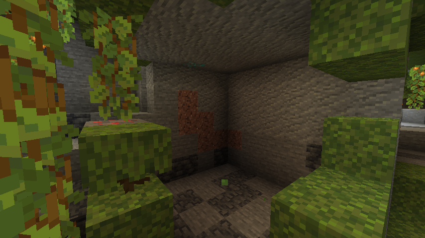
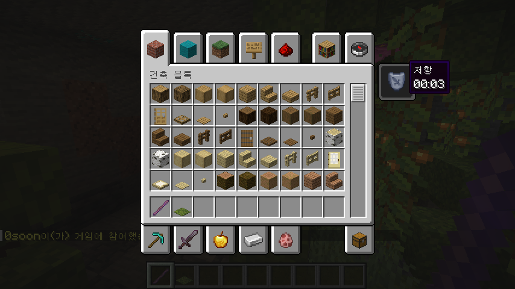

# 플러그인 개발로 JAVA 입문하기

1. [개발 시작하기](##개발-시작하기)
2. ["Hello World!"](##"hello-world!")
3. [/ping, "pong!"](##/ping,-"pong!")
4. [JAVA는 객체지향언어!](##java는-객체지향언어!)
5. [플러그인의 꽃, EventHandler](##플러그인의-꽃,-eventhandler)

## 개발 시작하기

### 1. 개발 환경 구축하기
[JDK](https://www.oracle.com/kr/java/technologies/downloads/)는 JAVA 개발을 위한 도구이며, JAVA를 실행하기 위한 JRE를 포함하고 있다.

[IntelliJ IDEA](https://www.jetbrains.com/idea/download/)는 JetBrains사에서 만든 JAVA 개발 도구이다. Minecraft 플러그인 개발을 위해서는 무료버전인 Community Edition을 사용하면 된다.

### 2. 프로젝트 생성하기


|항목|설정|
|---|---|
|Platform type|Plugin|
|Platform|Bukkit|
|Bukkit Platform|Spigot|
|Minecraft Version|1.19.2|

### 3. 테스트 환경 구축하기
[PaperMC](https://papermc.io/downloads) 다운로드\
eula.txt 파일을 열어 `eula=true`로 변경\
서버 실행 후 `plugins` 폴더에 생성된 플러그인을 넣고 서버 재시작

## "Hello World!"
[Tutorial.java](src/main/java/net/hassxxwxx/tutorial/Tutorial.java)
```java
```text
[00:00:00 INFO]: Hello World!
```

## /ping, "pong!"
[Ping.java](src/main/java/net/hassxxwxx/tutorial/Ping.java)
```text
> ping
[00:00:00 INFO]: pong!
```

## JAVA는 객체지향언어!

### ItemStack
[Push.java](src/main/java/net/hassxxwxx/tutorial/Push.java)

밀치기 100 막대기 지급

### Entity
[Rocket.java](src/main/java/net/hassxxwxx/tutorial/Rocket.java)

주변 엔티티를 날려버리기

### Block
[Empty.java](src/main/java/net/hassxxwxx/tutorial/Empty.java)

주변 블록을 공기로 바꾸기

## 플러그인의 꽃, EventHandler
[Join.java](src/main/java/net/hassxxwxx/tutorial/Join.java)

플레이어가 서버에 접속했을 때, 저항 효과 부여하기